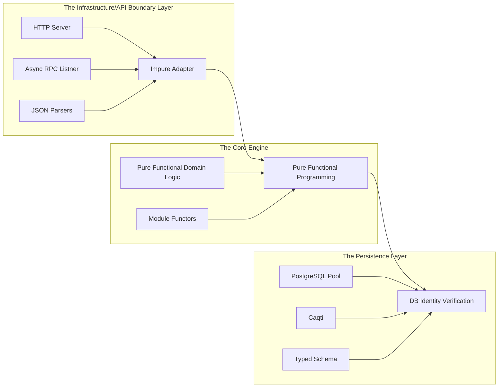

# typed-entitlements-service

A type-safe, OCaml service for managing multi-tenant user entitlements and basic Role-Based Access Control (RBAC), backed by PostgreSQL.

## High-Level Goal

The goal of this project is to demonstrate how OCaml's expressive type system and modules can be leveraged to enforce correctness, memory safety and strict authorisation boundaries at compile time. This eliminates common runtime security vulnerabilities and data races typically found in a backend service.

## The Problem

Non-trivial backend software routinely handles domain operations such as executing trades or querying medical information. Classic backend architectures rely on runtime checks such as DB queries to verify user permissions. This often introduces critical vulnerabilities such as:

### Privilege Escalation

Developer errors can easily lead to a missing validation check at a specific API endpoint or point in the call stack.

### Type Confusion

Passing a raw integer or string representing an `ID` into a database query expecting a specific type of `ResourceID`. Subtle problem... big consequences.

### Side-Effect Handling

Unhandled exceptions or connection leaks during complex authorisation failures cause weird things to happen.

## The Solution

This Service addresses these issues by lifting business domain permissions directly into the OCaml type system.

### Compile-Time Capabilities

Functions executing database modifications require a strongly typed "witness token" (Capability) that can only be instantiated via a successful deterministic authentication and authorisation pipeline.

### Abstract Identity Types

Database IDs are encapsulated in distinct, non-interchangeable abstract types.

### Monadic Control Flow

Leveraging explicit `Result.t` or `Or_error.t` paradigms alongside Jane Street Async library to guarantee that every predictable authorisation failure or network timeout is handled by the compiler. This avoids unhandled exceptions.

## Terminology
It might be helpful to define some terms so that we are speaking the same language.

### Definitions

#### Entitlements
The specific privileges or permissions a user possesses within a domain. (example: "Read X", "Create Y")

#### Role-Based Access Control (RBAC)
A method of regulating access to computer or network resources based on the `Roles` of individuals. `Users` are mapped to `Roles` which are mapped directly to `Entitlements`.

#### Tenancy (Organization)
Boundaries that isolate data. A user might be an `admin` in `Organisation A` but have absolutely no access to data in `Organisation B`.

## Mechanism

When a request is made to the service, it undergoes a multi-stage type filtering pipeline.
The incoming identity is parsed into an abstract token.
The engine queries Postgres to resolve the user's specific role for the requested tenant.
If the RBAC matrix allows the action, the service generates an internal compiler witness. The core business logic can only execute if the witness is passed to it as an argument.

## High-Level Architecture

### The Infrastructure/API Boundary Layer
Handles network IO using Jane Street's Async library. It sits at the absolute perimeter, parsing incoming data tokens, converting them securely into structured S-expressions, passing them down into the Core Engine and safely turning internal typed error variants into standardized network responses.

### The Core Engine
Contains the definition of the domain models, the RBAC state machine, and capability generators. It uses OCaml functors (parameterized modules) to remain entirely agnostic of how the data is stored or how requests are received. It treats the database as an abstract signature/interface.

### Persistence Layer
Implements the abstract database signature defined by the Core Engine. Uses Caqti to map OCaml types to the PostgreSQL schema. No raw SQL strings are premitted; queries are built using type-safe funcitonal combinators that fail to compile if the schema changes elsewhere.